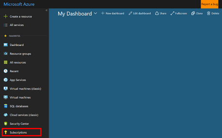
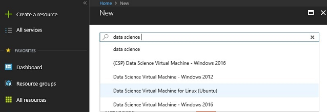
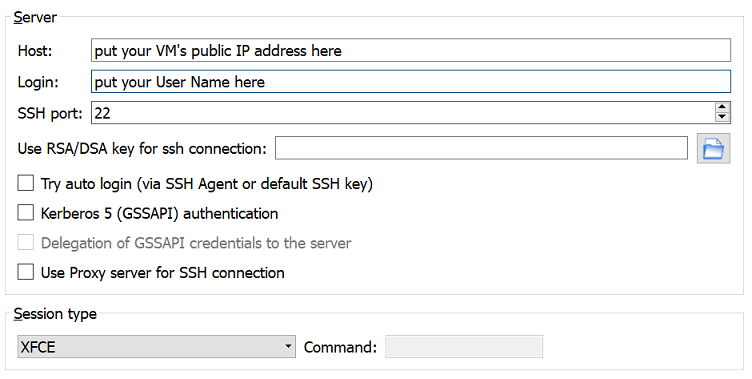
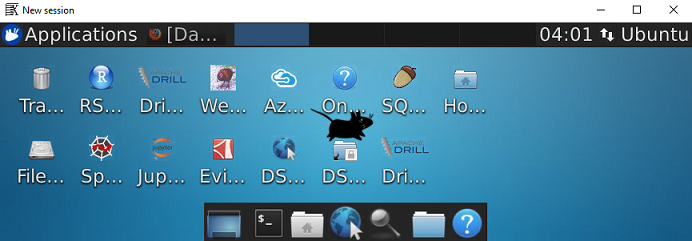

# Hands on Labs for SNU Deep Learning M2177.004300, 2018 Spring semester

This document aims to Deep learning infrastructure setup and MNIST practice 

For Azure credit, please contact your TA

## Topic

Cloud setup / GPU Instance creation and connection / MNIST example

### Cloud setup
[1. Microsoft ID creation for Azure service](#Ch1)

[2. Azure Subscription](#Ch2)

[3. Introduction to Azure](Ch3)

### GPU Instance creation
[4. Linux GPU Virtual Machine creation on Azure (Data Science Virtual Machine)](#Ch4)

[5. VM connect and GUI environment (Remote desktop client)](#Ch5)

[6. Connect to Jupyter Hub](#Ch8)

[7. GPU/CPU comparison](#Ch7)

[8. Using Python(Option)](#Ch6)

### MNIST example
[9. MNIST with Tensorflow](#Ch9)

<a name="Ch1"></a>
## 1. Microsoft ID creation for Azure connect

(Skip if you already have Microsoft account)

First of all, Microsoft ID is required to access Azure. Visit [Account creation page](https://account.microsoft.com/account?lang=en-US)and create Microsoft ID with any of your exising email address.


Click 'Sign in with Microsoft'


Click 'Create One'

Once you complete the registration, please summit your email address to your TA to receive subscription.

<a name="Ch2"></a>
## 2. Check Azure subscription

Welcome to Azure, cloud service of Microsoft. Your TA already have invited you to your subscription for this class. We will verify your subscription first. Please go to [Azure Portal](https://portal.azure.com) 

Please click 'Subscriptions' menu at left bottom.


By clicking your subscription name, you can mornitor your credit balance. Please remind that your credit is **limited** and you're liable to manage your own credit for this class.

If you have experienced Azure before this class, you may see other subscriptions. You MUST use subscription from your TA, otherwise the other subscription will charge you, while the subscription from TA doesn't cost you at all.

<a name="Ch3"></a>
## 3. Azure 101

Congraturations. Now you're permitted to utilize various Azure resources Azure. Azure Portal is web dashboard to use and monitor such services. 

Favorite provides easy access for your frequent usage. You can create own dashboard to monitor your resources.
Visit [Azure Portal Introduction](https://azure.microsoft.com/ko-kr/features/azure-portal/) and get more information.

<a name="Ch4"></a>
## 4. Linux GPU Virtual Machine (Data Science Virtual Machine)

Deploy Virtual Machine with GPU at Azure Data Center. In Azure, user can deploy virtual machine with Windows OS or Linux OS. For Deep learning purpose, Microsoft provides [Data Science VM](https://azure.microsoft.com/ko-kr/services/virtual-machines/data-science-virtual-machines/) including various toolkits within its image. User or researcher can save significant time to setup number of toolkits such as,

Anaconda Python 2.7, 3.5 / Microsoft R Open / Jupyter Notebook Server / Jupyter Notebook Hub / Visual Studio Code / Atom / Vim / Git / Tensorflow / Caffe & Caffe2 / Torch / Keras / CUDA

Click 'Create a resource' at left top. Type 'data science virtual machine' at search bar. Some options will be seen. Choose Data Science Virtual Machine for Linux(Ubuntu). 



Click 'Create' at bottom and go to the next step.

1. Basics

At this blade, you can set basic parameters for your virtual machine. 

- **Name** is an identifier in your Azure dashboard to distinguish your current virtual machine. In this exercise, we will use 'MyFirstVM'. 
- VM Disk Type: Select **HDD**
- **User Name**: user account to log in your ubuntu OS. Please memorise carefully.
- Authentication type: Two ways are possible. SSH / Password. In this exercise, choose **Password** and keep it well. More than 3 different category among upper/lower/number/special character is needed and at least 12 bytes. When you forget your password, you can reset at Azure Portal - reset password menu. 
- **Subscription**: Make sure your subscription comes from TA
- **Resource Group**: logical group to manage your various resources. Choose 'create new' and put 'MyFirstRG'.
- **Location**: Not all the region has GPU machines. Select **'East US'** for GPU access.


2. Size

Here, you can choose VM option for various performance and purpose. Azure provides range of different VM. 

Compute Type: Select **GPU**

Now you will see number of GPU instances. (If you don't have any options here, please go to previous step and make sure your chosen Region). Select **NC6**, and click 'Select' at bottom. NC VM has compute special GPU chipset for machine learning. ND stands for fast interence. NV stands for visual processing. Please visit [Nvidia](https://www.google.co.jp/url?sa=t&rct=j&q=&esrc=s&source=web&cd=1&cad=rja&uact=8&ved=0ahUKEwir6fb9v4HaAhWMoZQKHR_DC2IQFggpMAA&url=http%3A%2F%2Fwww.nvidia.com%2Fobject%2Ftesla-k80.html&usg=AOvVaw2UM_jLQqiHuJCYjUPaO71G)'s webpage for more information. 

3. Settings

This section is to set advanced settings, however, keep 'default' and click 'OK' at bottom. 

- **Availability Set** is a logical grouping capability that you can use in Azure to ensure that the VM resources you place within it are isolated from each other when they are deployed within an Azure datacenter.
- **Virtual Network** and **Subnet** are your own private network in the cloud. 
- **Public IP address** gives static public IP for VM. 
- **Network Security Group** contains a list of security rules that allow or deny network traffic to resources connected to Azure Virtual Networks (VNet). 

4. Create 

You will see the summarization of your first VM. Click checkbox and 'create' button. Once you finish all the process, you will monitor your deployment at right top alert menu. 

<a name="Ch5"></a>
## 5. VM connect and GUI client

In few minutes, you will have your first VM and icon at your dashboard. Click the icon and take a look for a while.


By clicking icon, detail information displays. At top, there is button for control VM - Restart, Start and Stop. Your VM's public IP is at mid point. At bottom, several monitoring stats are provided. Click 'Connect' at top.

You can use preferred tools to access VM, such as Putty, Bash Shell. Here we will use Cloud Shell in Azure Portal.


Click icon '>_' at right top at Azure portal. Choose Bash Shell, and create storage where Shell commands will be saved. You can execute Shell scripts at Azure portal.

```ssh Your User Name@Your public IP address```

(You can see it by clicking 'Connect' button at top.)

-------------
## VM management tip to save your credit 

GPU Instance highly costs and your credit is **limited**. When you're not using your GPU machine, make sure **STOP** your machine. Cloud environment allows you to pay as you go. Azure charges your credit minute-based calculation. Therefore, you can prevent unintended and unnecessary expenditure by stopping and restarting your machine.  

------------

## Warning for Linux Virtual Machine on Azure

Do not save any of your data at **temporary disk (/dev/sdb1)** on Azure virtual machine. The disk is logical drive to save temporary files from OS provisioning. Reboot of VM may result in initialization at this place. (D drive at Windows machine, too)

------------

## GUI Client

DSVM provides easy GUI setup. Only installation of client application, [X2Go](https://wiki.x2go.org/doku.php/doc:installation:x2goclient) is needed. 

Run X2Go client and setup for your VM.



- Session > New Session
- Host: your VM's public IP address
- Login: your user name set at Azure portal
- SSH Port: 22
- Session Type: **XFCE**

Click the session box, and put your password. 



----------------
## Ubuntu Update (optional)

Go to your terminal at Ubuntu.

```sudo apt-get update``` ## update package index

```sudo apt-get upgrade``` ## upgrade all installed package

```conda update conda``` ## Anaconda update

----------------

<a name="Ch6"></a>
## 6. Connect to Jupyter Hub

When DSVM runs, only internet access is required to connect Jupyter Hub at DSVM. 8000 port is used. 

```https://VM's_PublicIP/8000```  
Put it at your browser. Certificate issue will be raised. Use advanced setting by browser.

ID/PW of Jupyter Hub are reflected those at your VM.

Click Start MyServer.

----------------------
## ipynb file exchange at your server

Azure VM has several security options at default. The easiest way to upload and download file is to use Jupyter Hub with your web browser. 


<a name="Ch7"></a>
## 7. CPU/GPU performance comparison

To understand why Machine Learning requires GPU, let's execute simple python code below. Through this process, we can check the status of setup.

At Jupyter Hub

File > New Notebook > Python 3

Copy and paste code below and Run

[Simple Python code for comparison CPU/GPU](https://gist.github.com/3h4/f6e9cabbead201056c4705c2590d3d21#file-0-matrix-py)


<a name="Ch8"></a>
## 8. Python version (option)

DSVM contains two different version of Python at each path. 

Python 2.7 : /anaconda/bin 

```source /anaconda/bin/activate root```

Python 3.5 :  /anaconda/envs/py35/bin

```source /anaconda/bin/activate py35```


<a name="Ch9"></a>
## 9. MNIST example


